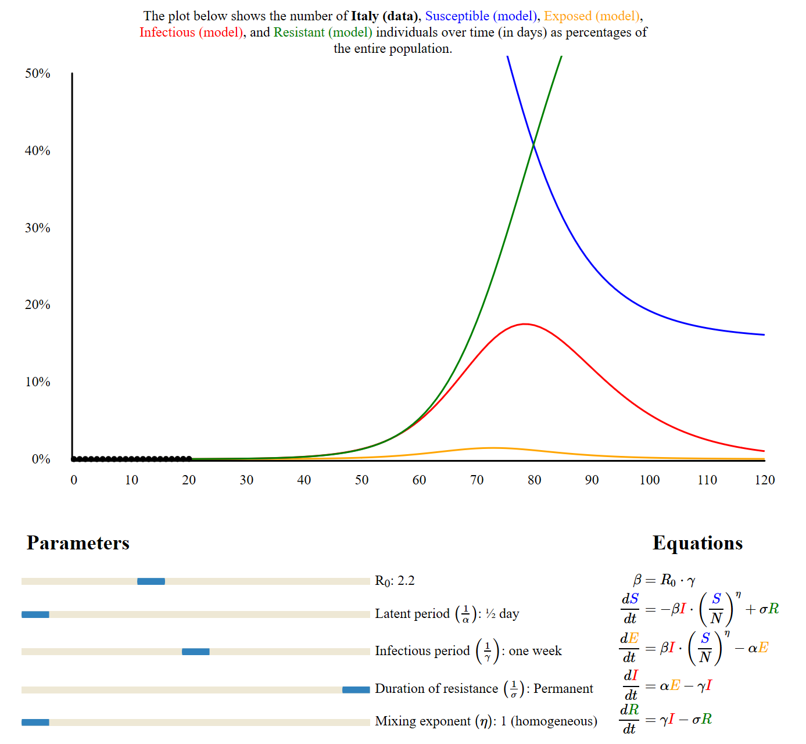

# Interactive SEIR disease model

This repository contains an interactive SEIR model with a try to match Cornavirus data from Italy.

Data from Italy are plotted in black.

Please note that I am not epidemiologist, the parameters might be wrong and the actions for containements are not taken into account  ..
If some epidemilogits could validate and contribute to this work .. it would be great !
Poeple need to know where we are going !

It is based on a work done by robmoss (https://github.com/robmoss/seir-demo) 
with default parameters set to match data from Italy.

## License

This model is distributed under the terms of the BSD 3-Clause license:

    Copyright (c) 2016, Rob Moss.  
    All rights reserved.
    Coronavirus Italy data addon by Philippe Collignon.

    Redistribution and use in source and binary forms, with or without
    modification, are permitted provided that the following conditions are
    met:

    1. Redistributions of source code must retain the above copyright notice,
       this list of conditions and the following disclaimer.

    2. Redistributions in binary form must reproduce the above copyright
       notice, this list of conditions and the following disclaimer in the
       documentation and/or other materials provided with the distribution.

    3. Neither the name of the copyright holder nor the names of its
       contributors may be used to endorse or promote products derived from
       this software without specific prior written permission.

    THIS SOFTWARE IS PROVIDED BY THE COPYRIGHT HOLDERS AND CONTRIBUTORS "AS
    IS" AND ANY EXPRESS OR IMPLIED WARRANTIES, INCLUDING, BUT NOT LIMITED TO,
    THE IMPLIED WARRANTIES OF MERCHANTABILITY AND FITNESS FOR A PARTICULAR
    PURPOSE ARE DISCLAIMED. IN NO EVENT SHALL THE COPYRIGHT HOLDER OR
    CONTRIBUTORS BE LIABLE FOR ANY DIRECT, INDIRECT, INCIDENTAL, SPECIAL,
    EXEMPLARY, OR CONSEQUENTIAL DAMAGES (INCLUDING, BUT NOT LIMITED TO,
    PROCUREMENT OF SUBSTITUTE GOODS OR SERVICES; LOSS OF USE, DATA, OR
    PROFITS; OR BUSINESS INTERRUPTION) HOWEVER CAUSED AND ON ANY THEORY OF
    LIABILITY, WHETHER IN CONTRACT, STRICT LIABILITY, OR TORT (INCLUDING
    NEGLIGENCE OR OTHERWISE) ARISING IN ANY WAY OUT OF THE USE OF THIS
    SOFTWARE, EVEN IF ADVISED OF THE POSSIBILITY OF SUCH DAMAGE.

This repository also includes [D3.js](https://d3js.org/) 3.5.17 (copyright
2010-2015 Mike Bostock), which is distributed under the terms of the BSD
3-Clause license.
